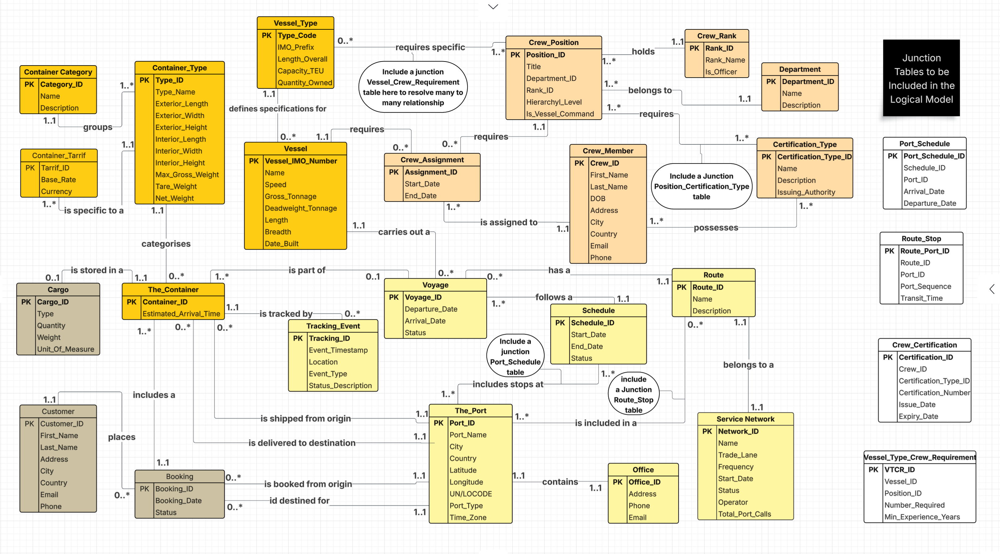
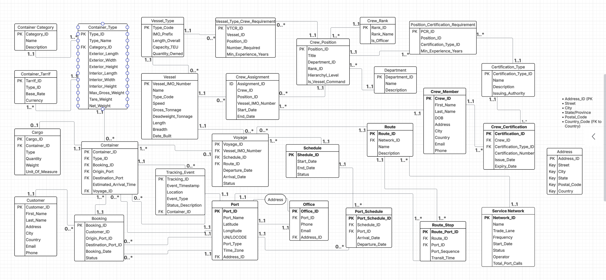

# Building a Database Management System for a Maritine Shipping Company

## Overview
This repository contains a relational database design for maritime shipping operations that I'm currently developing. The database focuses on container shipping management, vessel operations, crew assignments, and cargo bookings.

## Database Design

### Conceptual ERD

*The conceptual model shows the main entities and their relationships*

### Logical ERD

*The logical model includes all entities with attributes and relationship constraints*

## Database Structure
The database includes several interconnected components:
- **Container Management**: Container categories, types, and tariffs
- **Vessel Operations**: Vessel types and vessel information
- **Customer and Booking**: Customer data and booking management
- **Crew Management**: Crew members, positions, and certifications
- **Voyage Planning**: Schedules, routes, and port information
- **Event Tracking**: Container tracking and status updates

## Implementation Status
- ✅ Entity Relationship Diagram completed
- ✅ SQL table definitions created (see word file)
- ✅ Sample data populated (see word file)
- ✅ Basic relationships demonstrated (see word file)
- 🔄 SQL queries in development

## Demonstrated Relationships
The database demonstrates several relationships including:
- A schedule can consist of multiple voyages
- A customer can have many bookings
- A container has several tracking events
- A vessel has many crew assignments
- A crew member can have multiple certifications

## Design Challenges
Creating this database involved several challenges:
- Determining whether to center the design around vessels or voyages
- Establishing appropriate relationships between entities
- Avoiding redundancy while maintaining data integrity
- Balancing normalization with practical database usage

## Next Steps
I'm currently working on:
- Developing SQL queries for common business operations
- Further refining the data model
- Adding additional documentation

## License
MIT License
